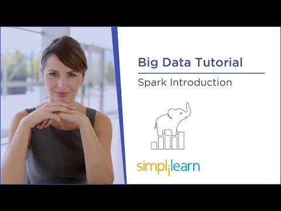
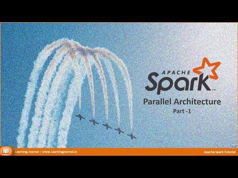

# Challenge 1: Understanding Apache Spark

In this challenge, you will watch two videos that introduce you to the concept and architecture of Apache Spark. For each video, we will provide a checklist of important knowledge points for you. Keep an eye on the checklist and keep assessing whether you have fully understood the concepts discussed in the videos. If you feel the videos do not provide you with adequate understanding of any of the knowledge points, google them or ask your instructor/TA.

**Suggested time on this lab: 60 min**

## Objectives

* Understand what Apache Spark is and what it does.
* Understand the basic concepts and terminologies about Apache Spark.
* Understand the architecture and applications of Apache Spark.

## Video 1: [Big Data Tutorial: Spark Introduction](https://www.youtube.com/watch?v=QaoJNXW6SQo)

**Video length: 15'39"**

Click the thumbnail below to link to the video.

### Key Knowledge Points

* What is Spark and why data scientists/engineers use Spark? 
* What are the differences between batch vs. real-time data processing?
* MapReduce, Hadoop, vs Apache Spark - what tasks is Spark suitable for?
* What are the 5 Spark components and what does each of them do?
* Reduce, Join, Filter, and Map - what does each of them do?
* What are structured, semi-structured, and unstructured data?
* What do the ODBC and JDBC drivers do in Spark?
* What are the advantages of in-memory data processing?
* Why does Spark use compression algorithms for in-memory data processing?
* How is in-memory data processing different from caching?
* Does Spark rely on Hadoop? What is the relation between Spark and Hadoop?
* What programming language is the Spark core written with?
* What programming languages does Spark support?
* What do *batch processing* and *streaming* mean in big data applications?
* List at least 3 use cases of Spark.

## Video 2: [Apache Spark Parallel Archhitecture](https://www.youtube.com/watch?v=vJ0eUZxF80s)

**Video length: 21'13"**

### Key Knowledge Points

* What are the two ways to execute programs in Spark? Which way is commonly used in development? Which way is used in production?
* What is a *master* process? What is a *slave/worker* process?
* Does the master or slave execute the *driver* application? Does the master or slave execute the *executer* application?
* What does it mean that Spark has a distributed architecture for scheduling, dispatching, analyzing, and monitoring? 
* How many master nodes can a Spark cluster have? How many slave nodes can a Spark cluster have?
* What are the 3 modes you can install Spark with?
* In development, which installation mode suits best? How about in production?
* In the client mode, where do driver and executers sit? How about in the cluster mode and local mode?
* What is a cluster manager and what does it do?
* Why must you install Java in order to run Spark on your local machine?

*Note: You only need to watch until 17'03". Also, from 14'05 - 17'03" this video shows you how to test your Spark in local mode. Since you will installed Spark in the next challenge, you don't need to manually do what the video shows you. Just keep in mind that after you start Spark on your computer, you can access the monitoring web interface in the browser.*

## Resources

[Spark Overview](https://jaceklaskowski.gitbooks.io/mastering-apache-spark/spark-overview.html)

[Spark Architecture](https://jaceklaskowski.gitbooks.io/mastering-apache-spark/spark-architecture.html)

[Big Data Tutorial: Spark Introduction](https://www.youtube.com/watch?v=QaoJNXW6SQo)

[Apache Spark Parallel Archhitecture](https://www.youtube.com/watch?v=vJ0eUZxF80s)